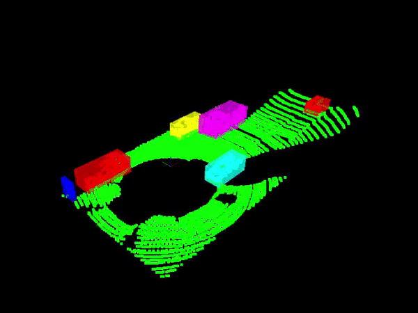

# Lidar Obstacle Detection

This project was done as part of the [Sensor Fusion course for self-driving cars](https://github.com/udacity/SFND-LIDAR-Obstacle-Detection). Official README and setup can be found at the bottom.


The main objectives of this project is to process LIDAR data from a HDL 64. The project includes 2 datasets with XYZI pointclouds recorded while driving on a street. Common obstacles within the observation are other cars, bicyles or street boundaries. The processing can be broken down in different calculations:
1. filter Pointcloud to reduce processing time
2. segment Points into road and obstacle segments
3. cluster obstacle segments to retrieve bounding boxes and soft classification ob obstacle

Relevant files for processing the input data:
```
src
--sensors
----data/pcd
------data_1 				// contains pcl files for track 1
------data_2 				// contains pcl files for track 2
--environment.cpp 			// initializes visualization and lidar_processing
--lidar_processing.h 			// loads params for visualization and initializes pcl-stream
--camera.h 				// contains camera settings
--filter.h 				// contains raw cloud filter
--ransac.h 				// contains 3D ransac for segmentation
--tree.h 				// contains KD-tree class
--clustering.h 				// contains euclidean clustering for obstacle detections
--render.h 				// contains rendering functions
--params.h 				// loads pipeline params for data stream
--params.txt 				// contains parameters for pipeline
```

All parameters relevant for this project can be changed while running the program within the params.txt file attached. 


## 1. Filter Point Cloud data

There are several steps included in filtering the raw input data. The first applied method is applying a voxel grid to the original data, to decrease the point cloud resulution. Afterwards two seperate crops are done to decrease the horizion of the data: we only care about close surroundings that are either ahead or next to us. Therefore we limit the data to 6 meters left and right and 25 meters upfront. Additionally the points that are closer than 1.5 meters around are likely to be our own car and therefore also cropped out. 

## 2. Point Segmentation

For seperating road and obstacles a segmentation is applied to the filtered data. When looking at the data its obvious that most points received actually display the road. Now properties of a road usually are that they are straight and even. Within an iterative process planes of random points are calculated evaluated against all points. After taking the plane with least overall distance after given iterations, we receive a good estimation of a road plane and can seperate every cloud point into road or obstacle.

## 3. Cluster obstacles

After successfully retrieving an obstacle segment of the filtered point cloud, different objects can be derived from its surroundings. Individual obstacles are identified by a distance from other objects. Points that have a density similar to the resolution of the filtered image likely define the boundaries of said object. From the individual objects outer boundaries a box is displayed around the object.


## Dataset 1



## Dataset 2


## Official README

### Welcome to the Sensor Fusion course for self-driving cars.

In this course we will be talking about sensor fusion, whch is the process of taking data from multiple sensors and combining it to give us a better understanding of the world around us. we will mostly be focusing on two sensors, lidar, and radar. By the end we will be fusing the data from these two sensors to track multiple cars on the road, estimating their positions and speed.

**Lidar** sensing gives us high resolution data by sending out thousands of laser signals. These lasers bounce off objects, returning to the sensor where we can then determine how far away objects are by timing how long it takes for the signal to return. Also we can tell a little bit about the object that was hit by measuring the intesity of the returned signal. Each laser ray is in the infrared spectrum, and is sent out at many different angles, usually in a 360 degree range. While lidar sensors gives us very high accurate models for the world around us in 3D, they are currently very expensive, upwards of $60,000 for a standard unit.

**Radar** data is typically very sparse and in a limited range, however it can directly tell us how fast an object is moving in a certain direction. This ability makes radars a very pratical sensor for doing things like cruise control where its important to know how fast the car infront of you is traveling. Radar sensors are also very affordable and common now of days in newer cars.

**Sensor Fusion** by combing lidar's high resoultion imaging with radar's ability to measure velocity of objects we can get a better understanding of the sorrounding environment than we could using one of the sensors alone.


## Installation

### Ubuntu 

```bash
$> sudo apt install libpcl-dev
$> cd ~
$> git clone https://github.com/udacity/SFND_Lidar_Obstacle_Detection.git
$> cd SFND_Lidar_Obstacle_Detection
$> mkdir build && cd build
$> cmake ..
$> make
$> ./environment
```

### Windows 

http://www.pointclouds.org/downloads/windows.html

### MAC

#### Install via Homebrew
1. install [homebrew](https://brew.sh/)
2. update homebrew 
	```bash
	$> brew update
	```
3. add  homebrew science [tap](https://docs.brew.sh/Taps) 
	```bash
	$> brew tap brewsci/science
	```
4. view pcl install options
	```bash
	$> brew options pcl
	```
5. install PCL 
	```bash
	$> brew install pcl
	```

#### Prebuilt Binaries via Universal Installer
http://www.pointclouds.org/downloads/macosx.html  
NOTE: very old version 

#### Build from Source

[PCL Source Github](https://github.com/PointCloudLibrary/pcl)

[PCL Mac Compilation Docs](http://www.pointclouds.org/documentation/tutorials/compiling_pcl_macosx.php)
